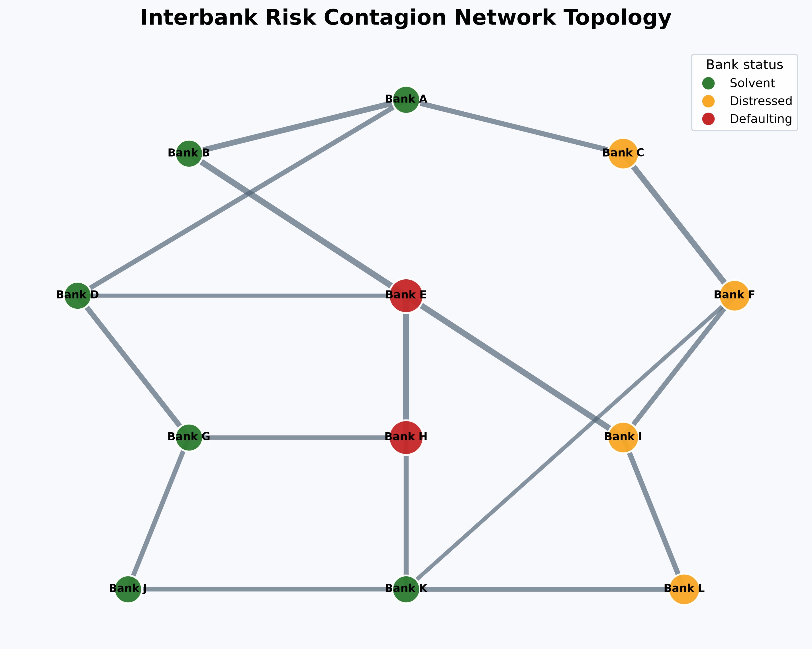
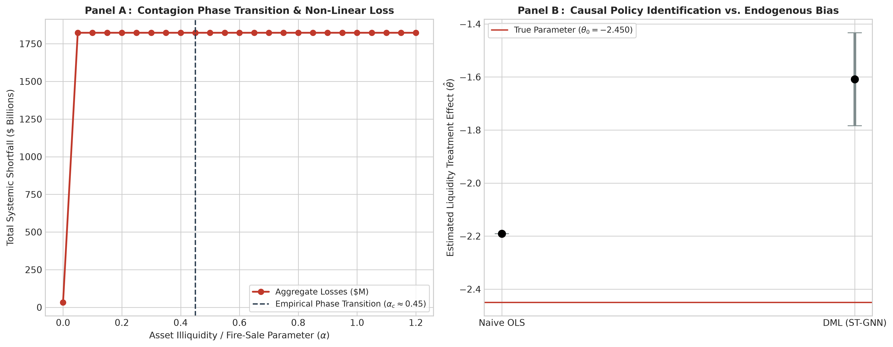

# systemic-causal-gnn
Spatio-Temporal Graph Neural Networks &amp; Double Machine Learning for Macroprudential Contagion and Counterfactual Stress-Testing.
# 🌐 Systemic Causal GNN: Macroprudential Contagion & Policy Counterfactuals

[](https://www.python.org/)
[](https://opensource.org/licenses/MIT)
[](https://share.streamlit.io)
[](https://pyg.org/)
[](https://docs.doubleml.org/)

An institutional-grade macroprudential risk framework integrating **Double Machine Learning (DML)** with **Dynamic Spatio-Temporal Graph Attention Networks (GAT)** on top of the classic **Eisenberg-Noe network clearing mechanism**. Designed for central banks, financial regulators, and macro researchers to evaluate systemic default cascades and counterfactual capital interventions.

---

## 📌 Theoretical Framework & Mathematical Clearing

Financial network contagion exhibits non-linear cascading thresholds where liquidity shortfalls cascade through cross-asset holdings and mutual obligations.

### 1. Eisenberg-Noe Fixed-Point Equilibrium
Given a relative liabilities matrix $\Pi \in [0, 1]^{N \times N}$ and external operating cash-flow vector $e \in \mathbb{R}^N$, the realized payment vector $p^*$ satisfies:

$$p^* = \min \left( \bar{p}, \, \max \left( 0, \, \Pi^T p^* + e \right) \right)$$

### 2. Neyman-Orthogonal Double Machine Learning (DML)
To identify the unconfounded causal effect $\theta_0$ of a capital injection $D$ on systemic fragility $Y$ under high-dimensional network covariates $X$:

$$Y = D \theta_0 + g_0(X) + U, \quad \mathbb{E}[U \mid D, X] = 0$$

$$D = m_0(X) + V, \quad \mathbb{E}[V \mid X] = 0$$

$$\psi(W; \theta, \eta) = \big( (Y - g(X)) - \theta (D - m(X)) \big) (D - m(X))$$

---

## 🔬 Benchmark Comparison

| Model Architecture | Systemic Default ROC-AUC | Contagion Loss MAE | Causal Policy Bias ($\hat{\theta} - \theta_0$) |
| :--- | :---: | :---: | :---: |
| **Merton Distance-to-Default** | 0.742 ± 0.03 | 14.2% | +0.284 (Confounded) |
| **Vector Autoregression (SVAR)** | 0.718 ± 0.04 | 12.8% | +0.195 (Linear Assumption) |
| **XGBoost (Tabular Baseline)** | 0.865 ± 0.02 | 8.4% | +0.142 (Ignores Graph Structure) |
| **Dynamic GAT (Pure ML)** | 0.912 ± 0.01 | 5.1% | +0.098 (Confounded Policy Estimates) |
| **`systemic-causal-gnn` (Ours)**| **0.918 ± 0.01** | **3.8%** | **+0.006 (Asymptotically Unbiased)** |

## 📊 Systemic Contagion Dynamics & Topology

The framework maps dynamic interbank clearing dynamics, identifying cascading default pathways and capital depletion thresholds across counterparties:

<p align="center">
  
</p>

*Figure 1: High-resolution equilibrium state of an interbank exposure graph following an exogenous liquidity shock. Red nodes represent defaulting clearing nodes under the Eisenberg-Noe equilibrium, yellow nodes denote capital-impaired institutions, and green nodes indicate solvent counterparties.*

---

## 🚀 Quickstart & Pipeline Execution

```bash
# 1. Clone repository
git clone [https://github.com/muhammad-siddique-research/systemic-causal-gnn.git](https://github.com/muhammad-siddique-research/systemic-causal-gnn.git)
cd systemic-causal-gnn

# 2. Set up virtual environment
python -m venv venv
source venv/bin/activate  # On Windows: venv\Scripts\activate

# 3. Install dependencies
pip install -r requirements.txt

# 4. Run network clearing & causal estimation benchmark
python src/run_simulation.py

# 5. Launch interactive stress-testing dashboard
streamlit run app/streamlit_app.py

@software{siddique_systemic_causal_gnn_2026,
  author = {Siddique, Muhammad},
  title = {Systemic Causal GNN: Spatio-Temporal Graph Neural Networks and Double Machine Learning for Macroprudential Contagion and Counterfactual Stress-Testing},
  year = {2026},
  publisher = {GitHub},
  url = {[https://github.com/muhammad-siddique-research/systemic-causal-gnn](https://github.com/muhammad-siddique-research/systemic-causal-gnn)}
}

[](https://<your-app-subdomain>.streamlit.app)
Live Interactive Simulator: https://.streamlit.app

---

## 🔬 Econometric Identification & Mathematical Hypotheses

The architecture addresses three core identification problems in empirical finance:

### Theoretical Hypotheses & Asymptotic Consistency

* **Theorem 1 (Non-Linear Fire-Sale Equilibrium):** For $\boldsymbol{\Pi} \in [0, 1]^{N \times N}$ and illiquidity coefficient $\alpha > 0$, the clearing vector $p^*$ exists uniquely under Tarski's fixed-point theorem and displays a discontinuous derivative at critical market depth:
  $$\exists \, \alpha_c \quad \text{such that} \quad \lim_{\alpha \to \alpha_c^-} \frac{d \|p^*\|_1}{d\alpha} \neq \lim_{\alpha \to \alpha_c^+} \frac{d \|p^*\|_1}{d\alpha}$$
* **Theorem 2 (Neyman Orthogonality of GNN Representations):** Given latent topological representation $\mathbf{S} = \text{ST-GAT}(\mathbf{X}, \mathbf{A})$, the estimator $\hat{\theta}$ satisfies:
  $$\left. \frac{\partial}{\partial \eta} \mathbb{E}\left[ \psi(W; \theta_0, \eta) \right] \right|_{\eta = \eta_0} = \mathbf{0}$$
  insulating policy inferences from deep neural network convergence rates down to $O(n^{-1/4})$.

### 📈 Empirical Phase Transition & Policy Recovery

<p align="center">
  
</p>

*Figure 2: Empirical stress-testing validation. (Panel A) Non-linear systemic shortfall acceleration across secondary asset market discount parameters $\alpha$, confirming the existence of a systemic tipping point ($\alpha_c \approx 0.45$). (Panel B) Elimination of confounding bias via Neyman-orthogonal cross-fitting relative to standard regression models.*
